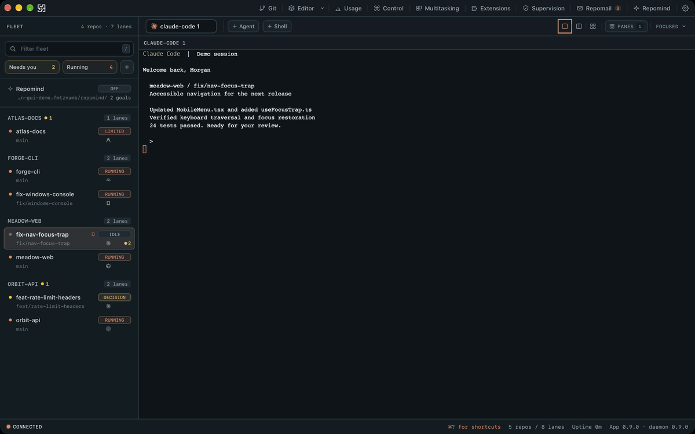

<p align="center">
  
</p>

# repomon

**Mission control for a fleet of AI coding agents across all your repos.**

Many repos × many worktrees × many agents, on one screen. Durable across restarts, the ones
waiting on you float to the top, and you can approve a prompt from your phone.

<p>
  <a href="https://github.com/AliHamzaAzam/repomon/releases/latest"></a>
  
  
  
  
</p>

**Install now:** [download the app](https://github.com/AliHamzaAzam/repomon/releases/latest), open it, add a repo. Nothing else to set up. Details below.

<!-- Hero demo GIF: docs/gui-demo.gif, produced by scripts/record-gui-demo.sh from a
     sandboxed instance of the desktop app with throwaway fake repos (no real data ever
     appears in it). If this image is missing or blank, the gif hasn't been recorded yet on
     this checkout, run the script (it needs macOS Screen Recording permission for your
     terminal app, granted once in System Settings > Privacy & Security > Screen Recording). -->
<p align="center">
  
</p>

Other tools run parallel agents in *one repo, many worktrees* (Claude Squad, Conductor,
Crystal, ccmanager). repomon is built for the developer juggling **5-15 active projects** with
a fleet of agents running at once: **many repos × many worktrees × many agents**, spawned and
steered from one place, in a desktop app or a terminal, whichever you reach for.

## Mission Control

Download the app, add a repo, and there's nothing left to configure: the daemon and a portable
`tmux` ship inside the bundle, so agents run durably (survive closing the window, reattach with
full scrollback) with no separate install. First launch walks you through a short onboarding
flow, and **Settings > System** shows a live health check for tmux, git, and every agent CLI,
with one-click-copy install commands for anything missing.

- **One fleet, every repo.** The sidebar groups lanes (repo + worktree) by project, sorts by
  recent activity, and floats the ones waiting on you. A lane with more than one agent running
  shows a live roster on hover, so you can see who's doing what without opening it.
- **Git explorer and editor, built in, side by side.** The right rail is a resizable (drag its
  edge), multi-panel host. Git (`⌘3`): branch status against its base, working-tree changes with
  per-file stats, commit history, a unified diff viewer, and clickable commit details (message,
  author, full patch). Editor (`⌘7`): a file tree over the lane's worktree, multi-file tabs with
  dirty tracking, and a full CodeMirror editor themed to match. If an agent changes a file you
  have open, you get a conflict banner (reload or keep mine) instead of a silent overwrite.
- **Self-service recovery.** Settings can stop, start, or reset the daemon and bulk-restore
  orphaned agent sessions, without a terminal.
- **Fleet mail between agents.** Address one agent, a whole lane (`lane-12/*`), or the whole
  fleet (`*`), with per-recipient delivery results.
- **repomind (work in progress).** An orchestrator agent that can run as Claude Code, Codex,
  Antigravity, or OpenCode and manage agents of every kind underneath it. Functional, still
  rough at the edges. See the [repomind section](#repomind-fleet-orchestrator-work-in-progress) below.

See [docs/desktop.md](docs/desktop.md) for the full keyboard reference and every setting.

## How it compares

|  | **repomon** | Claude Squad / ccmanager | GUI apps (Conductor, Crystal) | built-in `claude agents` |
|---|---|---|---|---|
| **Scope** | many repos × worktrees × agents | one repo, many worktrees | one repo, many worktrees | one tool, flat list |
| **Interface** | desktop app or TUI, same fleet | terminal only | GUI only | inside the CLI |
| **Runtime** | durable tmux: survives close, reattach | tmux | app process | inside the CLI |
| **Triage** | needs-you float to top, jump-to-next | flat list | varies | grouped by state |
| **Usage limits** | live usage corner + auto-continue | ✗ | ✗ | ✗ |
| **Remote** | open WebSocket bridge + APNs over Tailscale (iOS app soon) | ✗ | ✗ | ✗ |

Honest take: if you work in **one** repo, Claude Squad/ccmanager or a single-repo GUI may be
simpler. repomon earns its keep once you're running agents across **several** projects at once,
and it doesn't make you choose between a terminal and a GUI to get there.

## Architecture

A background daemon (`repomond`) owns SQLite, file watchers, the git layer, and the agent
runtime, exposing a JSON-RPC API over a local transport (Unix socket on macOS/Linux, named pipe
on Windows). The agent runtime sits behind a `SessionBackend` trait: tmux on macOS/Linux, and
per-agent host processes on Windows. Every client, the desktop app, the TUI, and the iOS
companion, is a thin client over that one API, so any of them can watch and drive the same fleet
at once. Five crates, plus the desktop app:

- `repomon-core`: data model, gix git layer, SQLite store, watchers, agent runtime (`SessionBackend`).
- `repomon-daemon`: the `repomond` socket/pipe server and background services.
- `apps/desktop`: Mission Control, the Tauri desktop app (`repomon-desktop`), bundling its own
  daemon and (on macOS/Linux) a portable `tmux`.
- `repomon-tui`: the `repomon` terminal UI.
- `repomon-mcp`: repomind's MCP server (`repomond mcp`), exposing the fleet to an orchestrator agent over stdio.
- `repomon-host`: `repomon-agent-host.exe`, the per-agent ConPTY host that gives Windows tmux-style durability (Windows only).

## Install

### Desktop app (recommended)

**macOS**
1. Download `Repomon_<version>_universal.dmg` from the [latest release](https://github.com/AliHamzaAzam/repomon/releases/latest) (one build, Apple silicon and Intel)
2. Open it, drag Repomon to Applications
3. Add a repo, go

**Windows**
1. Download `Repomon_<version>_x64-setup.exe` from the [latest release](https://github.com/AliHamzaAzam/repomon/releases/latest)
2. Run it
3. Add a repo, go

**Linux**
1. Download the `.AppImage`, `.deb`, or `.rpm` from the [latest release](https://github.com/AliHamzaAzam/repomon/releases/latest)
2. AppImage: `chmod +x` it and run. Deb: `sudo apt install ./Repomon_<version>_amd64.deb`
3. Add a repo, go

The bundle carries its own daemon and its own portable `tmux`. Nothing else to install first. It
updates itself after the first download (**Settings > General > Check for updates**). See
[docs/desktop.md](docs/desktop.md).

### Command line (TUI + headless `repomon`)

macOS / Linux:

```sh
curl -fsSL https://github.com/AliHamzaAzam/repomon/releases/latest/download/install.sh | sh
```

Homebrew (macOS):

```sh
brew install AliHamzaAzam/tap/repomon      # or: brew tap AliHamzaAzam/tap && brew install repomon
brew services start repomon                # optional: run the daemon at login
```

Needs `tmux` and `git` on the system (the desktop bundle ships its own; the CLI does not). No
tmux? `brew install tmux` (macOS), `sudo apt install tmux` (Debian/Ubuntu/WSL2),
`sudo dnf install tmux` (Fedora), `sudo pacman -S tmux` (Arch).

No prebuilt binary for your platform: `cargo install --git https://github.com/AliHamzaAzam/repomon repomon-tui repomon-daemon`.

Enable cd-on-exit (optional): add to `~/.zshrc` or `~/.bashrc`:

```sh
eval "$(repomon shell-init zsh)"   # bash: repomon shell-init bash · fish: repomon shell-init fish
```

**Windows CLI**, PowerShell:

```powershell
irm https://github.com/AliHamzaAzam/repomon/releases/latest/download/install.ps1 | iex
```

Puts `repomon.exe`, `repomond.exe`, and `repomon-agent-host.exe` in
`%LOCALAPPDATA%\Programs\repomon` on your user PATH (env overrides: `REPOMON_INSTALL_DIR`,
`REPOMON_VERSION` to pin a tag instead of latest). Then enable cd-on-exit by adding to your
PowerShell profile (`$PROFILE`):

```powershell
repomon shell-init powershell | Out-String | Invoke-Expression
```

### Run the daemon as a service (optional)

Both the CLI and the desktop app auto-start `repomond` on demand, so a service is never
required. To keep the daemon (and its notifications) alive across logins even with neither UI
open:

```sh
repomon daemon install     # macOS: launchd LaunchAgent · Linux: systemd user unit
```

On Linux this writes `~/.config/systemd/user/repomon.service`; run
`loginctl enable-linger` if you want `repomond` to survive logout.

### Linux platform notes

- Desktop notifications use `notify-send` (libnotify); the chime plays through
  `canberra-gtk-play` or `paplay` when present.
- Clipboard copy uses `wl-copy` (Wayland) or `xclip` (X11); inside tmux, drag-select falls
  back to OSC52 when neither is installed. Image paste needs `wl-paste` or `xclip`.
- Click-to-focus notifications are macOS-only (`terminal-notifier`).

### Windows platform notes

- **No tmux, no WSL.** On Windows repomon runs natively. Each agent runs in its own detached
  host process (`repomon-agent-host.exe`, a ConPTY + server-side terminal emulator) that plays
  exactly the durability role tmux plays on Unix: agents survive daemon restarts and re-adopt
  with full scrollback. The daemon talks to its clients and to the hosts over named pipes
  instead of Unix sockets.
- **Windows Terminal recommended** for the CLI. The desktop app renders its own terminals and
  doesn't depend on the host console.
- **ConPTY floor: Windows 10 1809.** The host relies on ConPTY, which requires Windows 10
  version 1809 or newer (Windows 11 fully supported). Claude Code on native Windows needs Git
  for Windows.
- **Keep the three CLI exes together.** `repomon.exe`, `repomond.exe`, and
  `repomon-agent-host.exe` must live in the **same directory**; the daemon spawns the host by
  looking next to itself. `install.ps1` and the release zip already place all three together.
  (The desktop bundle carries its own copies and doesn't need this.)

## Usage

```sh
repomon                                # just run it: starts the daemon if needed, then the TUI
repomon add ~/code/pos-saas            # register a repo
repomon discover ~/code --add          # or find and register many at once

# headless / scripting (also auto-start the daemon)
repomon lane list
repomon lane new --repo pos-saas --branch feat/inventory --source main
repomon lane delete feat/inventory --delete-branch
```

**`repomon` is the single command.** With no daemon running it launches a detached
`repomond` (which then survives across UI sessions), connects, and opens the TUI. If the
`repomond` binary can't be found it falls back to an in-process daemon. Use `--embedded` to
force in-process always, or manage the daemon with
`repomon daemon start | stop | restart | status | logs | install | uninstall`.

> **Building from source?** After a rebuild, run `repomon daemon restart` so the new code is
> served (the daemon outlives the UI). The dev build runs from `./target/debug/repomon`.

## repomind (fleet orchestrator, work in progress)

**Status: functional, not polished.** repomind works today, but expect rough edges: guardrail
behavior under real-world load isn't fully proven, and the UX (panel, notifications, dashboard)
is still catching up to the daemon-side feature set. Treat it as an early feature, not a
finished one.

repomind is an orchestrator agent for the fleet: a coding-agent session (Claude Code, Codex,
Antigravity, or OpenCode) wired to repomon's own MCP server, so it can read every lane's status
and act on your behalf, spawning workers, answering their permission prompts, and merging
finished work, while you supervise or check in only when it needs you. It's built into Mission
Control (the repomind panel, `⌘5`) and available from the CLI:

```sh
repomon orchestrate [--autonomy read-only|supervised|autonomous] [--max-agents N] [--model m] [prompt]
```

This makes sure the daemon is up, starts (or reuses) the single daemon-owned `orchestrator`
tmux window running the orchestrator agent, and attaches you to it. `prompt` is an optional
initial goal.

**TUI command-center** (`O` key, or `6`): a pinned fleet row plus a dashboard for repomind,
reachable like any other zoom level. The row and header escalate the moment repomind needs
you, a permission/decision dialog, or an end-of-turn wait, and fire a "repomind needs you"
desktop notification when the TUI isn't already looking at it. Press `i` to type straight to
repomind without leaving the view (mediated `send-keys`); `↵`/`→` attaches to its real tmux
pane instead.

**Guardrails.** By product decision, `--autonomy` defaults to `autonomous`, repomind may
create, merge, and delete lanes and run a goal end-to-end without asking first, bounded by a
few hard caps enforced server-side (not just requested in the prompt): a per-session action
cap (100 actions by default), a concurrent-agent cap (`--max-agents`, default 4), a 15s dedupe
on sending the same text to the same lane twice in a row, and a two-phase human-confirmation
flow for lane deletion (the first call only returns an impact summary and a token; the delete
only happens once that token comes back). Pass `--autonomy supervised` to have it propose lane
creation for you to confirm instead, or `--autonomy read-only` to keep it to observing.

Before merging a lane's work, repomind is expected to verify it: `lane_diff` (commits ahead of
base with diffstat, plus uncommitted changes) before `merge_lane` lands them.

## Remote access (open bridge over Tailscale)

The daemon serves the same JSON-RPC API over a token-gated WebSocket bridge, so you can drive
it from any client; the protocol is documented in [docs/protocol.md](docs/protocol.md). A
native **iOS companion app** (fleet view, live conversations, Approve button) is built and
ships once an Apple Developer account is in place; until then the bridge and `remote pair`
pairing work for any client you point at them. Bind it to your **private tailnet** address,
never a public interface; anyone holding the token can read your panes and type into your agents.

1. **Install [Tailscale](https://tailscale.com)** on the machine (and any device you'll connect
   from), signed into the same tailnet, so it can reach it at its `100.x.y.z` address.
2. **Enable the bridge**, then restart the daemon to apply:
   ```sh
   repomon remote enable     # detects the Tailscale IPv4, binds ws://<ip>:7878, mints a token
   repomon daemon restart
   ```
   No Tailscale detected? Pass the address yourself: `repomon remote enable --bind <ip:port>`.
3. **Pair a client:** `repomon remote pair` prints a QR (and a `repomon://<host:port>#<token>`
   link) for a client to connect.

Manage it with `repomon remote status` (shows the bind and a masked token),
`repomon remote enable --rotate-token` (mint a new token, then re-pair), and
`repomon remote disable` (stops serving; keeps the token). Each change needs a
`repomon daemon restart` to take effect.

## Prefer the terminal? The original TUI

repomon started as a terminal UI, and it's still a first-class client of the same daemon, not a
legacy mode: same fleet, same lanes, same agents, whichever one you have open.

```
REPOMON                                              14:02 fri 29 may 2026
━━━━━━━━━━━━━━━━━━━━━━━━━━━━━━━━━━━━━━━━━━━━━━━━━━━━━━━━━━━━━━━━━━━━━━━━━━━━━
FLEET   8 agents · 4 repos · 3 need you                    ↑ sorted: needs-you
─────────────────────────────────────────────────────────────────────────

  pos-saas ────────────────────────────────────────────────────────────
  ⏸ wt-checkout  hotfix/checkout-bug     claude  needs you   89↻   3m
  ▶ main         feat/supabase-migration claude  running    142↻  18m
  ○ wt-ui        spike/new-pos-ui                idle              2h

  montage-ai ──────────────────────────────────────────────────────────
  ⏸ wt-mcp       spike/mcp-batch         codex   needs you   44↻   8m
  ▶ main         phase-2-studio-floor    claude  running    201↻   2m

  ↑↓ select   ↵/→ open   spc babysit   n new-lane   / filter   g needs-you   q
```

<p align="center">
  
</p>

repomon is one tool with four **zoom levels**, one selection that follows you the whole way:

- **Fleet**: every agent on one screen; the ones waiting on you float to the top.
- **Split**: fleet sidebar + the selected agent's live output and an input line.
- **Babysit grid**: live tiles auto-sized to your window; watch and nudge several at once.
- **Focus**: one agent full-screen with full live terminal, input, and controls.

Arrow keys drive everything (`↵`/`→` zoom in, `esc`/`←` zoom out, `space` the grid). `⏸` flags
an agent that needs you; `g` jumps to the next one. Beyond the live views, three dashboards
(keys `2`/`3`/`4`): a per-repo **timeline** of commit density with cross-repo correlations,
detected **work sessions** (focused vs parallel, exportable to Markdown), and global commit
**search**.

**Shell integration (cd-on-exit).** Pressing `c` on a lane exits repomon and changes your shell
into that worktree. repomon writes the path to the file descriptor in `$REPOMON_CD_FD`; add the
wrapper to your `~/.zshrc` / `~/.bashrc` so the shell acts on it:

```sh
eval "$(repomon shell-init zsh)"   # bash: repomon shell-init bash · fish: repomon shell-init fish
```

On **Windows / PowerShell** the wrapper reads the path from a temp file (`$REPOMON_CD_FILE`)
instead of an inherited file descriptor; add it to your `$PROFILE`:

```powershell
repomon shell-init powershell | Out-String | Invoke-Expression
```

## Documentation

- [docs/architecture.md](docs/architecture.md): how the daemon, desktop app, TUI, and core fit together.
- [docs/desktop.md](docs/desktop.md): Mission Control, its keyboard shortcuts, and settings.
- [docs/protocol.md](docs/protocol.md): the JSON-RPC socket reference.
- [docs/agents.md](docs/agents.md): how agents run and how status is detected.
- [docs/agent-supervision.md](docs/agent-supervision.md): autonomous permission handling, wake-on-mail, and stall nudges for supervised lanes.
- [docs/windows-validation.md](docs/windows-validation.md): the manual Windows 11 end-to-end validation gate.
- [crates/repomon-host/PROTOCOL.md](crates/repomon-host/PROTOCOL.md): the frozen Windows agent-host control protocol.

## Status

**Done:** Mission Control (fleet, git explorer, in-app editor, onboarding, System Health,
self-service daemon recovery), the TUI (fleet/today, the agent multiplexer, the history
dashboard), the remote access layer (WebSocket bridge + APNs + pairing). All on macOS, Linux,
and Windows, each with native service/notification/clipboard/liveness paths.

**Work in progress:** repomind (cross-kind orchestration, fleet mail, playbooks, approval
memory, standing orchestrations) - functional, see the [repomind section](#repomind-fleet-orchestrator-work-in-progress).

**Windows: released, validation catching up.** CLI and desktop app both ship in every release
(`repomon-<version>-{aarch64,x86_64}-pc-windows-msvc.zip`, `Repomon_<version>_x64-setup.exe`): a
host-process backend (`repomon-agent-host.exe`) in place of tmux, named-pipe IPC, durability
parity with Unix. What's still pending: a physical Windows 11 end-to-end validation pass and
binary signing (see [docs/windows-validation.md](docs/windows-validation.md)) - until that
lands, treat Windows as newer and less battle-tested than macOS/Linux.

**Not started / deferred:** the iOS companion app (built, ships once an Apple Developer account
is in place), a web dashboard.

---

If repomon saves you a few context-switches a day, a star helps other people find it.

## License

Apache-2.0 © Ali Hamza Azam
