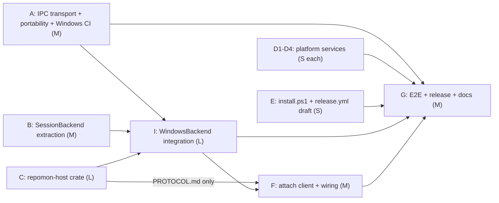

# Native Windows Support Implementation Plan (Master, Parallelized)

> **For agentic workers:** This is a **master plan** designed for parallel execution. Wave 1 tracks are independent — run them concurrently in isolated worktrees (superpowers:using-git-worktrees) via superpowers:dispatching-parallel-agents, subagent-driven-development, or separate Claude Code sessions. Before implementing a track, expand it into its own detailed task plan with superpowers:writing-plans, using this document as the spec. Steps use checkbox (`- [ ]`) syntax for tracking.

**Goal:** repomon (daemon + TUI + MCP) runs natively on Windows 10/11 — no WSL — with full durability parity: agents survive daemon restarts, exactly as they do under tmux on macOS/Linux.

**Architecture:** Extract a `SessionBackend` trait from the concrete `TmuxRuntime` (the single choke point all ~150 tmux call sites already funnel through). On Unix the tmux implementation is unchanged. On Windows, a new `WindowsBackend` talks to small per-agent **host processes** (`repomon-agent-host.exe`) that each own a ConPTY + the agent child + a server-side vt100 screen, and survive daemon restarts — replicating tmux's out-of-process durable server. Local IPC (daemon ⇄ TUI/MCP) moves behind a transport abstraction: Unix domain sockets on Unix, named pipes on Windows. The JSON-RPC wire protocol itself does not change.

**Tech Stack:** Rust workspace (edition 2024, toolchain pinned 1.95.0), tokio (`net` feature already includes Windows named pipes), `portable-pty` (ConPTY), `vt100` (already a dep of the TUI), `getrandom`, `tauri-winrt-notification`, ratatui/crossterm (already Windows-capable).

## Decisions (locked with the user, 2026-07-19)

1. **Durability: full parity day one.** Per-agent host processes that survive daemon restarts ship in the first Windows release. Daemon-owned-only agents are not an acceptable end state.
2. **Attach story: embedded + external window.** Focus view uses the existing embedded vt100 renderer; additionally, an agent can be popped out into a separate Windows Terminal tab via a raw byte-proxy attach client.
3. **Distribution: zip + install.ps1** on GitHub releases (scoop/winget deferred).
4. **Execution: parallelized.** Independent tracks run concurrently in isolated worktrees; fixed merge order resolves the few overlap points.

## Global Constraints

- Never break macOS/Linux: `cargo test --workspace --locked` must stay green on both existing CI legs after every task.
- The JSON-RPC wire protocol (envelopes, method names, params — `docs/protocol.md`) is **frozen**: the iOS companion app (separate private repo, RepomonKit) mirrors it. Transport may change; payloads may not. Additive optional fields only.
- Windows target: `x86_64-pc-windows-msvc` (aarch64 as a stretch goal in Track E). Minimum OS: Windows 10 1809+ (ConPTY requirement); Windows Terminal recommended.
- Keep the "one choke point" property: no direct tmux/ConPTY calls outside the backend implementations. All call sites go through `SessionBackend`.
- Prefer std/tokio + tiny focused crates; no libgit2, no heavyweight frameworks. New deps allowed: `portable-pty`, `getrandom`, `tauri-winrt-notification` (cfg(windows) only).
- tmux remains the Unix backend. This plan adds Windows; it does not migrate Unix off tmux.
- Per-track gate: `cargo fmt --check && cargo clippy --workspace --all-targets --locked -D warnings && cargo test --workspace --locked` plus `cargo check --target x86_64-pc-windows-msvc` (type-checks fine from macOS; `rustup target add` first).

## Why (context)

repomon's README says "Windows isn't supported natively yet; use WSL2." Exploration (3 recon reports, 2026-07-19) established:

- **tmux is the entire process runtime** — spawn, capture, input, resize, byte streaming (`pipe-pane` → `mkfifo` FIFO), durability, attach, orphan reaping, auto-continue, usage probe, plain terminals, orchestrator window. All of it funnels through `crates/repomon-core/src/agent/tmux.rs` (`TmuxRuntime`, ~25 methods, 936 lines). There is **no existing backend trait** — `Ctx.tmux` is the concrete struct (`crates/repomon-daemon/src/lib.rs:136`).
- **IPC is Unix-socket-only** — `tokio::net::UnixListener/UnixStream` in `crates/repomon-daemon/src/socket.rs`, `crates/repomon-core/src/client.rs`, `crates/repomon-mcp/src/lib.rs`, and every integration test. tokio has no Unix sockets on Windows; named pipes are the idiomatic replacement.
- **A long tail of Unix assumptions**: `mkfifo` (`bytes_stream.rs:122`), `/dev/urandom` (`tui/src/cli.rs:508`, `core/src/store/mod.rs:739`), `$HOME` reads (`rpc.rs:1912,2769,3430`), `$USER` (`config.rs:326`), `process_group(0)` (`tui/src/lib.rs:132`), `exec()` (`tui/src/cli.rs:493`), cd-on-exit via inherited fd (`tui/src/lib.rs:239`), `/tmp/repomon-panic.log` (`app.rs:4742`), ps+lsof/`/proc` liveness probe (`rpc.rs:3096-3187`), launchd/systemd-only service mgmt (`service.rs`), pbcopy/xclip clipboard, osascript/notify-send notifications, POSIX-only `install.sh`, no Windows CI/release target.
- **Already portable:** ratatui/crossterm TUI, vt100 embedded emulator, gix, rusqlite (bundled), notify (ReadDirectoryChangesW), directories, the WebSocket remote bridge (TCP + tungstenite), APNs push, clap_complete (has PowerShell).

## Architecture

### Windows session model (tmux-parity mapping)

```
                    Unix                          Windows
process registry    tmux window names             host registry dir + named pipes
                                                  <data_dir>\hosts\<session>\<window>.json
agent process owner tmux server (out-of-proc)     repomon-agent-host.exe (one per window,
                                                  detached, survives daemon restarts)
PTY                 tmux-owned pty                ConPTY (portable-pty) inside the host
capture-pane        tmux capture-pane -e -p       host-side vt100 screen render
send-keys           tmux send-keys                host writes to ConPTY input
pipe-pane + mkfifo  FIFO byte stream              host byte-subscription over its pipe
resize-window       tmux resize-window            host resizes ConPTY (last-client-wins)
attach              tmux attach (PTY handoff)     `repomon attach-host <window>` raw proxy
                                                  in a new Windows Terminal tab
@repomon-owner      tmux server option            owner token in registry dir + host handshake
kill-window         tmux kill-window              host kills child, exits, removes registry entry
```

Each host serves a tiny length-prefixed JSON control protocol on `\\.\pipe\repomon-<session>-<window>`: `hello` (window name, cwd, agent pid, program, started_at, last_activity, owner token), `capture`, `cursor`, `size`, `alternate_on`, `resize`, `send_literal`, `send_text`, `send_key`, `scroll_wheel`, `subscribe_bytes` (streams frames; first frame = full current-screen replay), `kill`. The host embeds `vt100` with scrollback so `capture`/`cursor`/`alternate_on` answer exactly what `capture-pane`/`display-message` answer on Unix.

**The host wire protocol is the inter-track contract.** Track C writes it down as `crates/repomon-host/PROTOCOL.md` in its first task and freezes it for the wave — Tracks I (WindowsBackend) and F (attach client) build against that document, not against C's code.

**Durability & re-adoption:** hosts are spawned with `DETACHED_PROCESS | CREATE_NEW_PROCESS_GROUP` and keep running when the daemon dies. On startup, `WindowsBackend` scans the registry dir, connects to each pipe, `hello`-verifies (stale entries whose pipe won't connect are GC'd), and re-adopts — the Windows equivalent of the daemon finding an existing tmux server. The reaper's `list_windows_with_activity` reads the same registry + hello data.

**Liveness probe:** on Windows, skip the ps/lsof//proc scan entirely — hosts *know* whether their child is alive (`rpc.rs:3096` gets a `#[cfg(windows)]` arm that asks the backend).

### `SessionBackend` trait (extracted in Track B)

Lives in `crates/repomon-core/src/agent/backend.rs`. Sync trait (all call sites already run in `spawn_blocking`); `Ctx.tmux: TmuxRuntime` becomes `Ctx.backend: Arc<dyn SessionBackend>`. Exact signatures are lifted mechanically from `tmux.rs` during extraction — shape:

```rust
pub trait SessionBackend: Send + Sync {
    fn available(&self) -> bool;
    fn session_exists(&self) -> Result<bool>;
    fn claim_or_verify_owner(&self, owner: &str) -> Result<OwnerState>;
    fn list_windows(&self) -> Result<Vec<String>>;
    fn list_windows_with_activity(&self) -> Result<Vec<WindowActivity>>;
    fn spawn(&self, window: &str, spec: &SpawnSpec) -> Result<()>;        // agent
    fn spawn_named(&self, window: &str, spec: &SpawnSpec) -> Result<()>;  // probe/orchestrator
    fn open_named(&self, window: &str, cwd: &Path) -> Result<()>;         // plain terminal (user shell)
    fn capture_named(&self, window: &str, opts: CaptureOpts) -> Result<String>;
    fn cursor_named(&self, window: &str) -> Result<Cursor>;
    fn size_named(&self, window: &str) -> Result<(u16, u16)>;
    fn resize_named(&self, window: &str, cols: u16, rows: u16) -> Result<()>;
    fn follow_client_named(&self, window: &str) -> Result<()>;
    fn alternate_on_named(&self, window: &str) -> Result<bool>;
    fn scroll_wheel_named(&self, window: &str, ev: ScrollEvent) -> Result<()>;
    fn send_literal_named(&self, window: &str, text: &str) -> Result<()>;
    fn send_text_named(&self, window: &str, text: &str) -> Result<()>;
    fn send_key_named(&self, window: &str, key: &str) -> Result<()>;
    fn kill_named(&self, window: &str) -> Result<()>;
    fn configure(&self) -> Result<()>;
    fn attach_command(&self, target: &str) -> Result<AttachCommand>; // program + args for a real terminal
    fn open_byte_stream(&self, window: &str) -> Result<ByteStream>;  // absorbs pipe_pane + mkfifo
    fn close_byte_stream(&self, window: &str) -> Result<()>;
}
```

Two deliberate design points:

- **`SpawnSpec` replaces shell strings.** Today `rpc.rs:1000-1023` assembles a `sh -c` string with `shell_quote` because tmux runs commands through `sh`. It already has the pieces structurally, so `SpawnSpec { program, args, cwd, env }` is built there; the tmux impl renders it to a quoted shell string (existing `shell_quote`), the Windows host feeds it to portable-pty's `CommandBuilder` directly. No `sh` on Windows, no `cmd /c` quoting hell.
- **`open_byte_stream` absorbs the FIFO.** `bytes_stream.rs` currently does `mkfifo` + tmux `pipe-pane 'cat > fifo'`. That whole rendezvous becomes backend-internal; `bytes_stream.rs` just consumes an `mpsc::Receiver<Vec<u8>>`-style handle from either impl.

### IPC transport abstraction (Track A)

New `crates/repomon-core/src/transport.rs`:

```rust
// Unix: tokio UnixListener/UnixStream at a filesystem path.
// Windows: tokio::net::windows::named_pipe at \\.\pipe\repomon-<user>.
pub async fn listen(endpoint: &Endpoint) -> Result<IpcListener>;   // accept() -> IpcStream
pub async fn connect(endpoint: &Endpoint) -> Result<IpcStream>;    // IpcStream: AsyncRead+AsyncWrite+Unpin+Send
```

`socket.rs::serve`/`handle_conn` and `client.rs::connect`/`spawn_io` become generic over `IpcStream`. `config::default_socket_path()` gets a `#[cfg(windows)]` arm returning the pipe name; the existing `socket_path` config override is interpreted as a pipe name on Windows. Embedded daemon: `\\.\pipe\repomon-embedded-<pid>`. Tests that use `UnixStream::pair()` switch to `tokio::io::duplex()`; integration tests use `transport::{listen,connect}` and run on all three OSes.

## File Map (created / heavily modified)

| Path | Role | Track |
|---|---|---|
| `crates/repomon-core/src/transport.rs` | **new** — IPC listener/stream abstraction (UDS ⇄ named pipe) | A |
| `crates/repomon-daemon/src/socket.rs`, `crates/repomon-core/src/client.rs`, `crates/repomon-mcp/src/lib.rs` | use `transport.rs` | A |
| `crates/repomon-core/src/{config,exec}.rs` | pipe-name arm, `USERNAME`, PATHEXT lookup | A |
| `crates/repomon-core/src/agent/backend.rs` | **new** — `SessionBackend` trait + `SpawnSpec`/`CaptureOpts`/etc. | B |
| `crates/repomon-core/src/agent/tmux.rs` | impl `SessionBackend for TmuxRuntime`; absorb FIFO logic into `open_byte_stream` | B |
| `crates/repomon-daemon/src/lib.rs` | `Ctx.tmux: TmuxRuntime` → `Ctx.backend: Arc<dyn SessionBackend>` | B |
| `crates/repomon-daemon/src/{rpc,reap,auto_continue,usage_watch,bytes_stream,notify_watch}.rs` | call sites → trait; `bytes_stream.rs` consumes `ByteStream` | B |
| `crates/repomon-host/` | **new crate** — `repomon-agent-host.exe`: PROTOCOL.md, ConPTY + vt100 + ring buffer + pipe control server | C |
| `crates/repomon-core/src/{clipboard,notify,service}.rs`, `crates/repomon-tui/src/app.rs` (image paste), `crates/repomon-tui/src/cli.rs` (shell-init, tailscale) | Windows arms | D1-D4 |
| `install.ps1` **new**, `.github/workflows/release.yml` | installer + release job | E |
| `crates/repomon-core/src/agent/windows.rs` | **new** — `WindowsBackend`: host spawning, registry scan/re-adoption, pipe client | I |
| `crates/repomon-daemon/src/rpc.rs:3096` | `#[cfg(windows)]` liveness arm via backend | I |
| `crates/repomon-tui/src/attach_client.rs` | **new** — raw attach proxy (`repomon attach-host <window>`) | F |
| `crates/repomon-tui/src/{app,cli,lib}.rs` | attach wiring, detach flags, `REPOMON_CD_FILE`, getrandom | A/B/F |
| `README.md`, `STATUS.md`, `docs/architecture.md`, `docs/agents.md` | docs | G |

---

## Execution model: waves, tracks, merge order



| Wave | Tracks (all concurrent within a wave) | Prereqs |
|---|---|---|
| **1** | A, B, C, D1 (clipboard+image paste), D2 (notifications), D3 (schtasks service), D4 (PowerShell shell-init + tailscale), E | none — start all nine now |
| **2** | I (WindowsBackend); F's attach **client** may start as soon as C freezes `PROTOCOL.md` | A+B+C merged (I); PROTOCOL.md (F-client) |
| **3** | F's TUI **wiring**; G (E2E on Windows, release finalize, docs) | I merged (F); everything (G) |

**Isolation & merge rules:**

- One worktree + branch + PR per track. **Merge order within Wave 1: A first, then B rebases on A; C/D/E are file-disjoint from both and land in any order.**
- Conflict hotspots are only `crates/repomon-tui/src/lib.rs` and `crates/repomon-tui/src/cli.rs` (A: detach flags, entropy, transport connect; B: attach-path refactor; D4: shell-init). The A-then-B-then-D4 merge order plus small-diff discipline resolves them; no other files are shared across Wave-1 tracks.
- Track A lands the `windows-latest` CI leg in its **first PR** (even before the rest of A is done, with not-yet-ported tests cfg-gated) so every other track gets Windows feedback continuously. Until then, all tracks run `cargo check --target x86_64-pc-windows-msvc` locally.
- Track C's `PROTOCOL.md` freezes at the end of C's first task; changes after that require touching I and F too — treat as a mini-RFC.
- D tracks are additive `#[cfg(windows)]` arms with pure-logic arg-builder tests that run on all OSes (mirror the existing `service.rs` pattern of testable systemctl/plist builders).

---

## Track A — IPC transport + portability + Windows CI (Wave 1, size M)

**Deliverable:** workspace compiles on `x86_64-pc-windows-msvc`; daemon ⇄ TUI ⇄ MCP talk over named pipes on Windows; `windows-latest` CI leg green (tmux tests self-skip).

- [ ] **First PR:** add `windows-latest` to `ci.yml` (fmt/clippy/test) with whatever cfg-gating is needed to be green immediately.
- [ ] `transport.rs` with unit tests (round-trip a length-prefixed frame) on both transports; port `socket.rs`, `client.rs`, `mcp/lib.rs`, embedded-daemon path, and all integration-test socket setup; `UnixStream::pair()` → `tokio::io::duplex()`.
- [ ] `config.rs`: `#[cfg(windows)] default_socket_path()` → `\\.\pipe\repomon-<user>`; `current_user()` falls back to `USERNAME`; unit tests.
- [ ] Entropy: replace both `/dev/urandom` reads (`tui/src/cli.rs:508`, `core/src/store/mod.rs:739`) with `getrandom`.
- [ ] `$HOME` direct reads (`rpc.rs:1912,2769,3430`) → `config::home()`; panic log `/tmp/repomon-panic.log` (`app.rs:4742`) → `service::log_dir()`-based path.
- [ ] Daemon detach: `#[cfg(windows)]` `creation_flags(DETACHED_PROCESS | CREATE_NEW_PROCESS_GROUP)` in `tui/src/lib.rs::spawn_daemon`.
- [ ] `exec.rs::find_in_path`: PATHEXT-aware lookup on Windows (`.exe/.cmd/.bat`) — required to find `claude` (npm shim), `git`, `wt`.
- [ ] Fix the ps/lsof probe cfg so it can't misfire on Windows: `#[cfg(not(target_os = "linux"))]` → `#[cfg(all(unix, not(target_os = "linux")))]` at `rpc.rs:3096` (Track I adds the real Windows arm).

**Verify:** existing macOS/Linux suites green; Windows CI green with tmux tests skipped; manual on a Windows box: `repomon` starts the daemon, Fleet view renders, repo/lane CRUD works (no agents yet).

## Track B — `SessionBackend` extraction (Wave 1, size M, pure refactor)

**Deliverable:** zero behavior change on macOS/Linux; all tmux knowledge behind the trait.

- [ ] `backend.rs` (trait + `SpawnSpec`, `CaptureOpts`, `Cursor`, `WindowActivity`, `OwnerState`, `AttachCommand`, `ByteStream`); implement for `TmuxRuntime` by delegation — signatures lifted from `tmux.rs`.
- [ ] `SpawnSpec` refactor of command assembly in `rpc.rs:1000-1023` (+ adopt path `:1039`, usage probe, orchestrator, `terminal.open`); tmux impl renders via existing `shell_quote`.
- [ ] `Ctx.tmux` → `Ctx.backend: Arc<dyn SessionBackend>`; mechanical call-site sweep (`rpc.rs`, `reap.rs`, `auto_continue.rs`, `usage_watch.rs`, `notify_watch.rs`, `main.rs`).
- [ ] Fold `mkfifo`/`pipe-pane` from `bytes_stream.rs` into the tmux impl's `open_byte_stream`; `bytes_stream.rs` becomes transport-agnostic.
- [ ] TUI attach paths (`app.rs:5289`, `cli.rs:484`) consume `attach_command()` via a new **optional** RPC field instead of building `tmux ... attach` strings client-side (additive only — iOS-safe).
- [ ] Full existing test suite green on macOS + Linux; snapshot tests unchanged.

## Track C — `repomon-host` crate (Wave 1, size L)

**Deliverable:** a standalone, tested host binary. No daemon integration in this track.

- [ ] **First task: write and freeze `crates/repomon-host/PROTOCOL.md`** — length-prefixed JSON control protocol (`hello`, `capture`, `cursor`, `size`, `alternate_on`, `resize`, `send_literal`, `send_text`, `send_key`, `scroll_wheel`, `subscribe_bytes` with full-screen replay first frame, `kill`), pipe naming (`\\.\pipe\repomon-<session>-<window>`), registry file schema (`<data_dir>\hosts\<session>\<window>.json`), owner-token handshake, per-user DACL requirement.
- [ ] ConPTY child via `portable-pty`; server-side `vt100::Parser` with scrollback (history-limit parity with tmux `configure()`); last-activity tracking; last-client-wins resize; clean child-exit (window disappears, like tmux).
- [ ] Named-pipe control server implementing PROTOCOL.md; registry JSON write/remove on start/exit.
- [ ] Pure-logic tests (protocol codec, vt100 capture rendering from canned byte streams) that run on **all** OSes; Windows-only integration tests (spawn `cmd.exe /c echo`, capture, send_text, resize, kill) — the first real agent-runtime coverage on Windows CI.

## Tracks D1-D4 — platform services (Wave 1, size S each, fully independent)

- [ ] **D1 Clipboard** (`clipboard.rs`, `app.rs:5391`): copy via PowerShell `Set-Clipboard` over stdin (UTF-16-safe; avoid clip.exe codepage mangling), paste via `Get-Clipboard -Raw`, image paste via `(Get-Clipboard -Format Image).Save(...)` → existing temp-PNG flow.
- [ ] **D2 Notifications** (`notify.rs`): `tauri-winrt-notification` toast + toast audio (replaces afplay/paplay) behind `#[cfg(windows)]`; respect existing quiet/gating logic.
- [ ] **D3 Service** (`service.rs`): Task Scheduler arm — pure `schtasks` arg-builder functions (testable everywhere, matching the systemctl/plist pattern) + install/uninstall/start/stop/status.
- [ ] **D4 Shell integration** (`cli.rs`, `lib.rs::emit_cd`): PowerShell `shell-init` emitting a `repomon` function using `REPOMON_CD_FILE` (temp file instead of inherited fd; fd path stays on Unix); un-reject powershell (test at `cli.rs:764` inverts); tailscale detection via PATH + `C:\Program Files\Tailscale\tailscale.exe`.

## Track E — packaging draft (Wave 1, size S)

- [ ] `install.ps1`: latest-release download, extract `%LOCALAPPDATA%\Programs\repomon`, user-PATH update, `irm ... | iex` one-liner; mirrors `install.sh` env overrides (`REPOMON_INSTALL_DIR`, `REPOMON_VERSION`).
- [ ] `release.yml`: `windows-latest` job → `x86_64-pc-windows-msvc` (aarch64 stretch), zip `repomon.exe` + `repomond.exe` + `repomon-agent-host.exe`, upload. Runs on a branch tag to validate before Wave 3.

## Track I — `WindowsBackend` integration (Wave 2, size L; needs A+B+C merged)

- [ ] `agent/windows.rs`: implement `SessionBackend` — spawn hosts detached with `SpawnSpec`; sync pipe client (`std::fs::File` open of `\\.\pipe\...`); registry scan + hello verification + stale GC; **re-adoption on daemon start** (durability parity); `list_windows_with_activity` from registry+hello; single-owner guard via token file; `open_byte_stream` → `subscribe_bytes`.
- [ ] Backend selection in `repomon-daemon/src/lib.rs` (`#[cfg]`).
- [ ] Liveness probe `#[cfg(windows)]` arm: ask backend/hosts (child pid alive per cwd) instead of ps/lsof.
- [ ] Windows CI integration tests mirroring `tests/integration.rs` flows (spawn/capture/input/kill/reap/auto-continue) without tmux.

**Verify (Windows box/VM):** spawn Claude Code agent → Running/Waiting cycles; kill `repomond.exe`, restart → agent alive and re-adopted, scrollback intact; reaper GCs a hand-killed host; auto-continue fires on a simulated usage-limit capture.

## Track F — attach experience (client in Wave 2 after PROTOCOL.md; wiring in Wave 3 after I)

- [ ] `attach_client.rs` / `repomon attach-host <window>`: enable VT console modes, raw stdin → input, byte subscription → stdout, console-resize → `resize` (last-client-wins), F12 detach (tmux parity).
- [ ] Launch: `wt.exe new-tab --title <lane> -- repomon attach-host <window>`; fallback `CREATE_NEW_CONSOLE`. Wire into `attach_command()` + TUI ↵/→/a keys.
- [ ] `terminal.open` plain terminals: host runs user's shell (`COMSPEC`/pwsh detection).

**Verify:** attach opens a WT tab mirroring the agent live; typing in either view stays consistent; detach leaves agent running; alt-screen apps (Claude Code's TUI) render correctly.

## Track G — E2E, release, docs (Wave 3, size M)

- [ ] Docs: README badge → "macOS · Linux · Windows", install section, "Windows platform notes" (Windows Terminal recommended, no tmux needed, ConPTY floor Win10 1809, unsigned-binary SmartScreen note), STATUS.md, `docs/architecture.md` SessionBackend/host section, `docs/agents.md` attach notes.
- [ ] Release finalize: tag flow end-to-end, zip checksums, install.ps1 one-liner tested on a clean VM.
- [ ] Full E2E checklist (below) on Windows 11.

## Verification (end-to-end, Windows 11 + Windows Terminal + native Claude Code)

1. `install.ps1` → `repomon` launches, daemon auto-spawns, `repomon service install` registers logon task.
2. Add repo → create lane (worktree under `C:\Users\<u>\code\...`) → spawn Claude agent → needs-you triage cycles.
3. Kill `repomond.exe`; relaunch TUI → agents re-adopted, scrollback intact.
4. Focus view embedded rendering + input; pop-out attach in WT tab; detach; clipboard copy/paste + image paste; toast fires on needs-you.
5. `repomon shell-init powershell` → cd-on-exit works. Remote bridge pairing from the iOS app against the Windows daemon (protocol untouched — should just work).

## Risks / watch items

- **ConPTY quirks:** resize repaints differ from real ttys; some sequences are synthesized by ConPTY. Mitigation: server-side vt100 is the source of truth for capture; test against Claude Code's TUI early in Track C.
- **Agent CLIs on native Windows:** Claude Code supports native Windows (requires Git for Windows); Codex/Aider support varies — the tmux-alive status fallback becomes host-alive and must degrade gracefully.
- **npm `.cmd` shims** can't always be spawned as bare programs by CreateProcess — `CommandBuilder` handles this, but verify `claude` spawn early in Track C.
- **Named-pipe security:** explicit current-user-only DACL on daemon + host pipes.
- **Parallel-merge risk:** the only shared files across Wave-1 tracks are `tui/src/lib.rs` and `tui/src/cli.rs` — enforce the A → B → D4 merge order and keep those diffs minimal.
